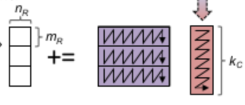

1. ****Hardware****
   - MacBook M2 2022
   - 8-core CPU with 4 performance cores and 4 efficiency cores
   - 100GB/s memory bandwidth
   - 16GB unified memory

2. ****Compiler(clang++ --version)****
   - Homebrew clang version 20.1.3
   - Target: arm64-apple-darwin23.5.0
   - Thread model: posix
   - InstalledDir: /opt/homebrew/Cellar/llvm/20.1.3/bin
   - Configuration file: /opt/homebrew/etc/clang/arm64-apple-darwin23.cfg

3. ****IDE****
   - CLion 2024.3.2
   - Runtime version: 21.0.5+8-b631.30 aarch64 (JCEF 122.1.9)
   - VM: OpenJDK 64-Bit Server VM by JetBrains s.r.o.
   - .NET Core v8.0.11 ARM64 (Server GC)


## Basic Optimization Techniques
Make our instruction independent and parallelize the code as much as possible. Take advantage of the memory hierarchy,
We need to minimize the number of cache misses and maximize the use of registers.
1. **Algorithm Level:**
   - Block matrix multiplication for cache efficiency 
   - Packing matrices for better memory access patterns 
   - Loop tiling and unrolling

2. **Hardware Level:**
   - SIMD parallelization (AVX/NEON)
   - Thread-level parallelization 
   - Thread affinity and NUMA awareness

## Same Techniques but using OMP


### Blocking
1. **Blocking for Cache Efficiency**
    - Divide matrices into smaller blocks to fit into cache
    - Reduce the number of memory accesses by a factor of:
    - 
2. **My implementation:**
   ```c++
   // Block size definitions
   #define M_BLOCKING 64
   #define N_BLOCKING 192
   #define K_BLOCKING 192

   // update block size for larger matrices
	size_t m_block = M_BLOCKING;
	size_t n_block = N_BLOCKING;
	size_t k_block = K_BLOCKING;
	if (M > 1024) {
        m_block = 64;
        n_block = 128;
        k_block = 128;
	}
	if (M > 1664) {
        m_block = 32;
        n_block = 64;
        k_block = 64;
    }

   // Loop over blocks, j,k,i
   for (size_t j = 0; j < N; j += n_block) {
       for (size_t k = 0; k < K; k += k_block) {
           for (size_t i = 0; i < M; i += m_block) {
               // Process block
           }
       }
   }
   ```
### Packing for Cache Efficiency
1. **Matrix Packing**
    - Pack matrices into contiguous blocks to improve cache locality
    - Use aligned memory allocation for packed matrices
    - 

2. **My implementation:**
   ```c++
   // Pack A in panels that match the micro-kernel (MR x K)
   // Pack B in panels that match the micro-kernel (K x NR)
   for (size_t mp = 0; mp < M; mp += MR)
       {
           const size_t m_min = M - mp > MR ? MR : M - mp;
           for (size_t k = 0; k < K; k++)
           {
               size_t kMR = k * MR;
               #pragma omp simd
               for (size_t m = 0; m < m_min; m++)
               {
                   packed[kMR + m] = A_data[(ib + mp + m) + (kb + k) * LDA];
               }
   
               // Pad with zeros if needed
               /* ... */
           }
           packed += MR * K; // Move to the next panel
       }
   ```

### Micro-Kernel
1. **Micro-Kernel Implementation**
   - Spilt blocks into a micro-kernel for the innermost loop
   - 
   
2. **My implementation:**
   ```c++
   // Micro-kernel for matrix multiplication
   #define MR 8
   #define NR 8
   
   for (size_t jr = 0; jr < nc; jr += NR) {
   size_t n_micro = nc - jr > NR ? NR : nc - jr;
     for (size_t ir = 0; ir < mc; ir += MR) {
        size_t m_micro = mc - ir > MR ? MR : mc - ir;
        // Execute micro-kernel 8x8
        micro_kernel();
     }
   }
     ```

### Loop Unrolling
1. **Loop Unrolling**
   - Unroll loops for SIMD
   - Load data into registers and perform computations
   - Apply `#pragma omp simd` to innermost loops
   - 

2. **My implementation:**
   ```c++
   // For each element in the column of A, multiply by row of B, full unrolling
   #pragma omp simd
   for (size_t j = 0; j < NR; j++)
   {
      float b_val = B[k + j * K];
      c[0][j] += a0 * b_val;
      c[1][j] += a1 * b_val;
      c[2][j] += a2 * b_val;
      c[3][j] += a3 * b_val;
      c[4][j] += a4 * b_val;
      c[5][j] += a5 * b_val;
      c[6][j] += a6 * b_val;
      c[7][j] += a7 * b_val;
   }
   
   // vecrorized version
   float a_vals[8] = {a0, a1, a2, a3, a4, a5, a6, a7};
   // Process in vector blocks where possible
   #pragma omp simd
   for (size_t j = 0; j < NR; j++) {
       float b_val = B[k + j * K];
       for (int m = 0; m < 8; m++) {
          c[m][j] += a_vals[m] * b_val;
      }
   }
   ```

## Multithreading (Parallel) Considerations for OpenMP GEMM

### Parallelization Strategy
1. **Parallelize Outer Loop**
    - Which loops to parallelize
        - Parallelize outer loops for better load balancing
        - Use `collapse` clause to parallelize nested loops
    - Parallelism within cores
      - better to parallelize the jr loop
      - 
      -  one of the threads will load the elements into the L1 cache, and all other threads will use it before it is evicted.
      - 
    - Parallelism between cores
      - better to parallelize the ic loop, as each core has its own L2 cache.
      - 
      - 
      - However, if parallelism between cores is only attained by this loop, performance will be poor when M is small
   ```c++
   #pragma omp parallel for collapse(2)
   for (size_t i = 0; i < M; i += M_BLOCKING) {
       for (size_t j = 0; j < N; j += N_BLOCKING) {
           // Process block (i,j)
       }
   }
   ```

### Thread Scheduling in OpenMP
1. **Schedule Clause Options**
    - `static`: Each thread gets a fixed chunk of iterations
        - Good for uniform workloads with predictable computation time
        - Consider setting appropriate chunk size based on cache line size
    - `dynamic`: Threads request new chunks when they finish their assigned work
        - Better for irregular workloads or systems with varying core speeds
        - Experiment with chunk sizes (start with matrix dimension / (4 * num_threads))
    - `guided`: Starts with large chunks that decrease in size
        - Can help balance overhead and load balancing
    - `auto`: Let the runtime decide (may vary between implementations)

2. **Chunk Size Optimization**
    - Too small: High scheduling overhead
    - Too large: Poor load balancing
    - Optimal size often depends on matrix dimensions and hardware characteristics
    - For GEMM, chunk sizes should align with cache blocking strategies

3. **My implementation:**
   ```c++
   // Parallelize outer loop with dynamic scheduling
   #pragma omp parallel for schedule(dynamic, 1)
   for (size_t i = 0; i < M; i += M_BLOCKING) {
       // Process code...
   }
   ```


### First-Touch Policy Implementation
1. **Memory Initialization Strategy**
    - Initialize matrix data with the same thread that will process it
    - Use parallel initialization to establish proper page ownership

2. **Explicit Implementation**
   ```c++
    // allocated on the physical memory closest to the CPU core that first writes to them
    // Fill with random values in range [min, max]
    void randomize(T min = 0, T max = 1) {
    #pragma omp parallel
    {
        std::mt19937 gen(std::random_device{}() + omp_get_thread_num());
        std::uniform_real_distribution<T> dist(min, max);

        // thread initializes memory
        #pragma omp for schedule(static)
        for (size_t j = 0; j < cols_; ++j) {
            for (size_t i = 0; i < rows_; ++i) {
                at(i, j) = dist(gen);
            }
        }
    }
   ```

### Thread Affinity
1. **Thread Affinity Settings with OpenMP(Not for Mac)**
    - Use `OMP_PROC_BIND` to control thread binding
    - Experiment with `OMP_PLACES` to optimize thread placement
      ```shell
      setenv OMP_PLACES cores
      setenv OMP_PLACES "threads(4)"
      setenv OMP_PLACES "{0:4},{4:4},{8:4},{12:4}"
      ```
    - Use `numactl` to bind processes to specific NUMA nodes

2. **My implementation:**
   ```Makefile
   # in Makefile, set env variables for OpenMP
   OMP_ENV := OMP_PLACES="{0,4},{1,5},{2,6},{3,7}" OMP_PROC_BIND="spread" 
   ```
3. **MacOS Affinity Settings**
   - QoS (Quality of Service) - bind threads to performance or efficiency cores
   ```c++
   // use for pthread
     int qos = QOS_CLASS_USER_INITIATED;
     scheduler[i].coreAffinity = kCoreAffinity_OnlyPerformance;
     
     if (i < ponyint_e_core_count()) {
         qos = QOS_CLASS_UTILITY;
         scheduler[i].coreAffinity = kCoreAffinity_OnlyEfficiency;
     }
     
     if(!ponyint_thread_create(&scheduler[i].tid, run_thread, qos, &scheduler[i]))
         return false;
   ```

### NUMA-Aware Code
1. **NUMA Considerations**
    - Use `numa_alloc_onnode` for memory allocation on specific NUMA nodes
    - Set thread affinity to specific cores using `numactl` or `sched_setaffinity`
    - Ensure that threads access data from their local NUMA node to minimize latency
    - Use `numa_free` to free allocated memory
2. **My implementation:**

   ```c
    void* numaAwareAlloc(size_t size, int node)
    {
       #ifdef _NUMA
         return numa_alloc_onnode(size, node);
       #endif
       return aligned_alloc(64, size);
    }
   
    // Set thread affinity to specific cores (0-7)
    int thread_id = 0;
    #ifdef _OPENMP
       thread_id = omp_get_thread_num();
    #endif
    int numa_node = 0;
    #ifdef _NUMA
       if (useNuma) {
       // Get the NUMA node for the current thread
       numa_node = thread_id % numa_num_configured_nodes();
       float *packed_A = (float *)numaAwareAlloc(M_BLOCKING * K_BLOCKING * sizeof(float), numa_node);
       float *packed_B = (float *)numaAwareAlloc(64, K_BLOCKING * N_BLOCKING * sizeof(float), numa_node);
       }
    #endif
      
    /* critical section*/
      
    numaAwareFree(packed_A, M_BLOCKING * K_BLOCKING * sizeof(float));
    numaAwareFree(packed_B, K_BLOCKING * N_BLOCKING * sizeof(float));
   ```
## Performance Results


## References
- https://siboehm.com/articles/22/Fast-MMM-on-CPU
- https://salykova.github.io/matmul-cpu
- https://www.cs.utexas.edu/~flame/pubs/blis3_ipdps14.pdf
- https://en.wikipedia.org/wiki/Apple_M2#:~:text=The%20high%2Dperformance%20cores%20have,cache%20shared%20by%20the%20GPU
- https://github.com/flame/how-to-optimize-gemm
- https://developer.apple.com/forums/thread/674456